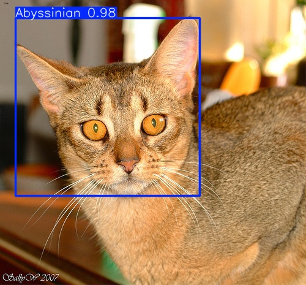
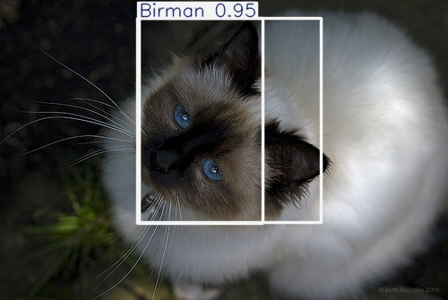
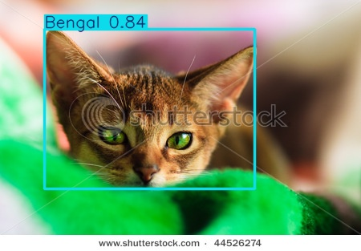

# 🚀 Deep Learning Assignment 2: Object Detection


---

## Overview

This project explores **object detection using deep learning** on small datasets, focusing on the trade-off between **accuracy and speed**.

Two models are implemented and compared:

- **Faster R-CNN (MobileNetV3 FPN)** — high accuracy, slower  
- **YOLOv8n** — fast, lightweight, real-time  

Experiments were conducted on:

- Penn-Fudan Pedestrian Dataset  
- Oxford-IIIT Pet Dataset (6-class subset)

---

## Project Structure
 deep-learning-assignment2/
│
├── data/

│ ├── PennFudanPed/

│ ├── images/

│ ├── annotations/

│ └── oxford_pet_yolo/

│

├── src/

│ ├── dataset.py

│ ├── train_fasterrcnn.py

│ ├── predict_fasterrcnn.py

│ ├── evaluate_fasterrcnn.py

│ ├── prepare_oxford_pet_yolo.py

│ ├── train_yolov8_pets.py

│ ├── evaluate_yolov8_pets.py

│ └── predict_yolov8_pets.py

│
├── outputs/

├── runs/

├── notebooks/

├── reports/

└── README.md


---

## Datasets

### Penn-Fudan Pedestrian Dataset
- ~170 images  
- Task: Pedestrian detection  
- Includes segmentation masks and bounding boxes  

---

### Oxford-IIIT Pet Dataset (Subset)

A subset of **6 cat breeds**:

- Abyssinian  
- Bengal  
- Birman  
- Bombay  
- British Shorthair  
- Egyptian Mau  

Dataset processing:
- XML annotations → YOLO format  
- Split: **70% train / 15% val / 15% test**

---

## Models

### Faster R-CNN
- Two-stage detector  
- Region Proposal Network + classifier  
- Higher accuracy, slower inference  

---

### YOLOv8n
- Single-stage detector  
- Real-time performance  
- Faster but slightly lower accuracy  

---

## Setup

### 1. Clone repo

```bash
git clone https://github.com/YOUR_USERNAME/deep-learning-assignment2.git
cd deep-learning-assignment2
```

### 2. Create virtual environment

```bash
python3 -m venv venv
source venv/bin/activate
```
### 3. Install dependencies
```bash
pip install -r requirements.txt
```
## Running the Project
### Faster R-CNN (Penn-Fudan)
#### Train
```bash
python src/train_fasterrcnn.py
```
#### Evaluate
```bash
python src/evaluate_fasterrcnn.py
```
#### Predict
```bash
python src/predict_fasterrcnn.py
```
### YOLOv8 (Oxford Pet)
#### Prepare dataset
```bash
python src/prepare_oxford_pet_yolo.py
```
#### Train
```bash
python src/train_yolov8_pets.py
```
#### Evaluate
```bash
python src/evaluate_yolov8_pets.py
```
#### Predict
```bash
python src/predict_yolov8_pets.py
```

## Results
### Quantitative Comparison

| Dataset    | Model        | Precision | Recall | mAP@0.5 | Training Time | Inference Speed |
| ---------- | ------------ | --------- | ------ | ------- | ------------- | --------------- |
| Penn-Fudan | Faster R-CNN | 0.8154    | 0.9464 | 0.9410  | 819.57 s      | 6.52 img/s      |
| Oxford Pet | YOLOv8n      | 0.7863    | 0.9036 | 0.9037  | ~943 s        | ~17.45 img/s    |

### Key Observations
- Faster R-CNN achieved higher accuracy and recall
- YOLOv8n achieved much faster inference speed
- YOLO is better suited for real-time applications
- Faster R-CNN is better for tasks requiring precision

This aligns with general findings that Faster R-CNN is more accurate but slower, while YOLO prioritizes speed.
## Sample Predictions
### Correct Detection



The model correctly identifies the cat with a tight bounding box and high confidence.

---

### Multiple Detection



The model successfully detects multiple objects in a single image.

---

### Misclassification



The model incorrectly classifies an Abyssinian cat as a Bengal, showing a limitation in distinguishing similar breeds.

## Discussion

The results highlight a clear trade-off:

### Faster R-CNN
- More accurate
- Better recall
- Slower inference
### YOLOv8n
- Much faster
- Slightly lower accuracy
- More practical for real-time use

Even with small datasets, both models performed well due to transfer learning, which allows pretrained models to adapt effectively.

## Limitations
- Small dataset size limits generalization
- Only 6 classes used for Oxford Pet
- Training done on CPU (no GPU acceleration)

## Future Improvements
- Train on full Oxford Pet dataset
- Use GPU for faster training
- Experiment with larger YOLO models (YOLOv8s, YOLOv8m)
- Add data augmentation for better robustness
## Conclusion

This project demonstrates how different object detection models behave under limited data conditions.

- Faster R-CNN provides better accuracy
- YOLOv8n provides better speed

The choice of model depends on the application:

- Accuracy-critical → Faster R-CNN
- Real-time systems → YOLO
